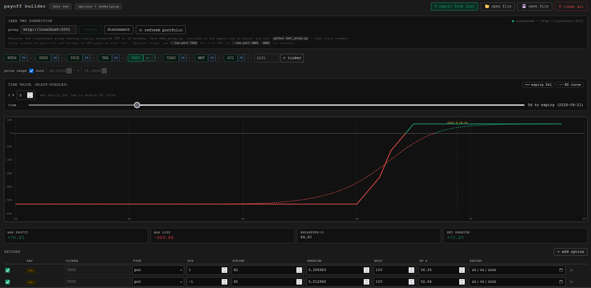

# Options Payoff Chart Builder for IBKR

A lightweight, browser-based options payoff visualizer that integrates directly with Interactive Brokers (IBKR) via TWS or IB Gateway. It allows you to model multi-leg option strategies, incorporate underlying stock positions, and visualize expiration payoffs alongside dynamic Black-Scholes curves.

## Architecture & Logic

The tool is designed to be completely local and consists of two standalone components:

1. **`ibkr_proxy.py`**: A Python Flask application that acts as a bridge between your web browser and IBKR. It uses `ibapi` to connect to TWS or IB Gateway, fetching your live portfolio positions and extracting real-time or frozen Implied Volatility (IV) for your options.
2. **`options_payoff_ibkr.html`**: A single-page HTML application. It connects to the local proxy to import your positions, calculates theoretical option pricing using the Black-Scholes model, and renders the interactive payoff chart using Chart.js.

## How to Start

### 1. Prerequisites

Ensure you have Python installed, then install the required dependencies:

```bash
pip install ibapi flask flask-cors
```

### 2. Configure IBKR TWS / Gateway

In TWS or IB Gateway, navigate to **Settings > API > Settings**:

- Check **Enable ActiveX and Socket Clients**
- Check **Allow connections from localhost only** (Recommended)
- Note your Socket port (default is `7497` for TWS Paper trading, `4002` for Gateway Paper).

### 3. Run the Proxy

Start the Python proxy bridge. By default, it attempts to connect to TWS paper trading on port `7497` and serves the API on port `5001`.

```bash
python ibkr_proxy.py
```

_(Optional flags: use `--tws-port 7496` for live TWS, or `--tws-port 4001`/`4002` for Gateway.)_

_(You can also choose the IBKR market data type with `--market-data-type 1|2|3|4` where `1=Live`, `2=Frozen` (default), `3=Delayed`, and `4=Delayed frozen`.)_

_For example, to use delayed data from IB Gateway:_

```bash
python ibkr_proxy.py --tws-port 4001 --market-data-type 3
```

_The included `ibkr_proxy_start.bat` already launches the proxy with delayed data via `--market-data-type 3`._

## Features

- Syncs directly with IBKR portfolio and retrieves exact positions and average cost bases.
- Gracefully attempts to pull Implied Volatility even when the market is closed (frozen data).
- Interactive crosshair showing precise payoff expectations on both the expiration curve and the time-adjusted Black-Scholes curve.
- Export/Import portfolio layouts to JSON.
- Manually add custom option legs and underlying positions to test hypothetical trades.

### 💡 Pro Tip: Shifting the P&L Curve

If you want to account for previously collected premiums (e.g., from closed or rolled legs), you can shift the entire payoff curve up or down. To do this, manually add two opposite options that cancel each other out (e.g., +1 Call and -1 Call at the exact same strike and expiry). Set the premium of one to `0`, and the other to the net premium amount you want to adjust by. This shifts your net profit/loss baseline without altering the underlying shape of the options curve.

## Disclaimer

This project is provided as-is. No ongoing support, maintenance, or future updates are planned.

Use at your own risk.

## Donations

If you find this project useful and would like to support the work that went into its development, donations are appreciated.

Ethereum / Base (ETH): `0xBA1903cEb50F92dDBde94498D14cdCc31fEFB7f9`<br>
Solana (SOL): `GrXWomqeGMzAcCCbYQ1Qq32t9qtsrsr4bTZTNcar1QLQ`


